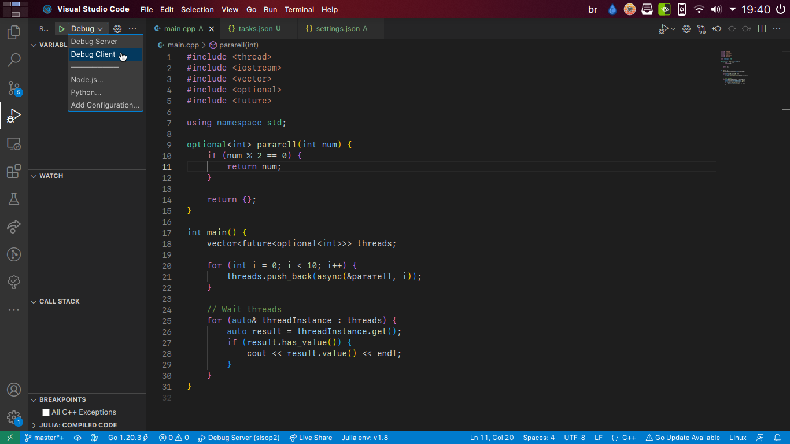

## Ambiente de Desenvolvimento

O auto-complete e o comando de compilação já estão configurados pro VSCode, é só abrir a pasta.

### Rodando

Pra compilar no braço, basta rodar o comando `make`, ele irá compilar todos os arquivos e o resultado irá pasta build.
Para rodar o programa, execute `make client` ou `make manager`
Para limpar sua pasta de build, execute `make clear_build`

Apertando F5, a IDE compila e roda o programa em modo de debug. Para mudar se você quer rodar o cliente ou o servidor, navegue até o menu de debugging e selecione a configuração desejada:

## Padrões de Código

O projeto não vai ser um troço enorme, então isso são menos regras e mais sugestões para tornar nossa vida menos miserável usando C++. Se sentir que burlá-los uma vez ou outra vai nos dar menos trabalho, vá em frente!

- Não use ponteiros, use referências. O compilador é mais exigente com elas, e você ganha a garantia que elas nunca serão nulas, pegando coisas que poderiam dar um `NullPointerException` em tempo de compilação.
  - Então no lugar de declarar `int* ponteiro`, use `int& referencia`.
- Não jogue exceptions. Em código multithreaded isso vira mais infernal que em código normal. Se sua função tem chance de falhar e não pode retornar o resultado esperado, mude seu retorno para usar um `optional`.
  - `Status get_status_from_host() { ... }` vira `optional<Status> get_status_from_host() { ... }`.
- *Eu preciso de uma thread que gera dados e uma que consome esses dados, como eu faço?* Pra resolver o problema do produtor/consumidor, vamos tentar usar **canais** até não dar mais (eu não sei onde surgiu a ideia, mas eu vi pela primeira vez em [golang](https://golangdocs.com/channels-in-golang)). São uma maneira de manter comunicação entre processos paralelos sem danificar a sanidade mental de quem está programando. Uma task põe coisas dentro dele, e outra vai tirando. Usa-se assim:
  - A função "pai" dos processos cria um canal, e o passa como referência para duas (ou mais) funções paralelas
  - Quando uma função põe dados no canal, se o canal já está carregando algum dado, ela fica bloqueada até que alguém pegue aquele dado na outra ponta.
  - Quando uma função tenta pegar dados no canal, se não há nenhum, ela fica bloqueada até que alguém ponha algum dado na outra ponta.

## Separação em Arquivos

Todos os arquivos que não são a `main.cpp` devem conter um header (`exemplo.h`) com as definições de tipos e protótipos de funções, e um arquivo de código (`exemplo.c`) com essas implementações. **NOTA: FUNÇÕES COM TEMPLATE DEVEM FICAR NO .h!!!**